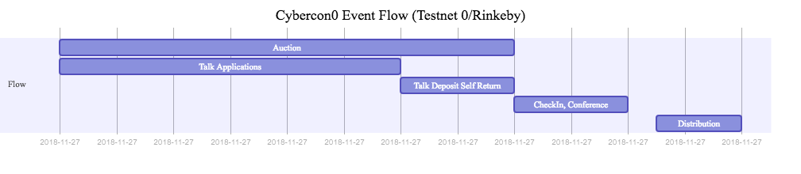
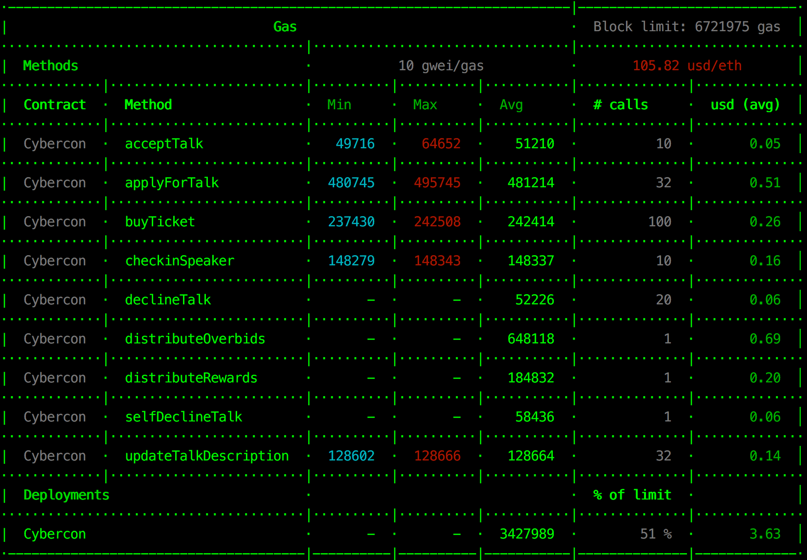

## cybaca

Self-driven community event organizer

### Prepare
```
Truffle and ganache-cli should be installed
```

### Bootstrap
```
npm i
```

### Tests
```
ganache-cli -p 7545 -a 250 -e 100 -i 5777
```

### Migration
```
truffle migrate --network development --reset
```

### Code for verification
```
truffle-flattener contracts/Cybercon.sol > cybercon0_full.sol
```

### Event Flow 


### Gas Usage 

